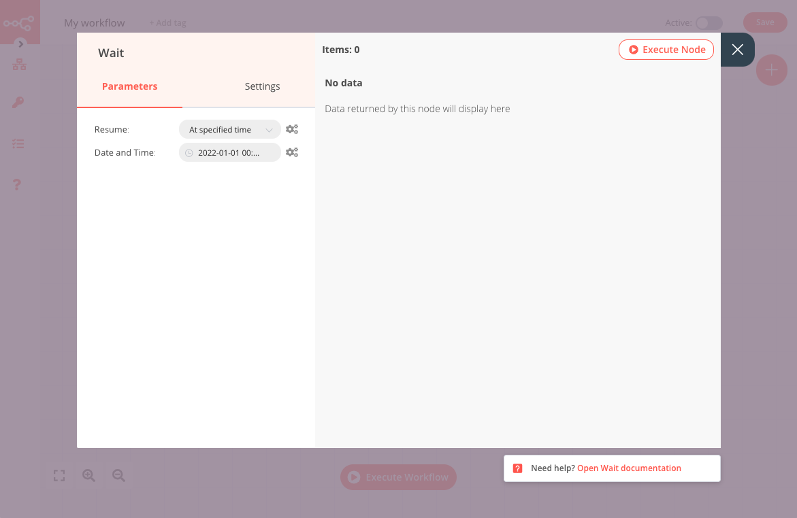

# Wait

The Wait node is used to create a pause of any desired duration in your workflows. When the workflow is paused the execution data is offloaded to the database, and when the resume condition is met it is reloaded and the execution continues.

The Wait node can be be set to resume on the following conditions:

* [**After time interval**](#time-interval)
* [**At specified time**](#specified-time)
* [**On webhook call**](#webhook-call)

::: tip 💡 Keep in mind
For the time-based resume operations, note that:
* For wait times less than 65 seconds, execution data is not offloaded to the database to resume later but rather the process continues to run and execution resumes after the specified interval passes.
* The n8n server time is always used regardless of the timezone setting. Workflow timezone settings, and any changes made to them, do not affect the Wait node interval or specified time. 
:::

## Time interval

Use the ***After time interval*** resume operation to set a desired interval after which the execution will resume.

Set the desired *Amount* and the corresponding *Unit* for the Wait operation. Decimals can be used for fractional units, for example `1.5` minutes instead of `90` seconds.

To automatically resume workflow execution after 15 minutes, the Wait node configuration would look like this:

## Specified time

Use the ***At specified time*** resume operation to set a particular date and time in the future when the workflow execution should resume.

For example, if you want the workflow execution to continue at midnight of New Year's Day 2022 the Wait node configuration would look like this:

## Webhook call

Use the **On webhook call** resume operation to configure your workflow execution to resume when an HTTP call is received.

::: tip 💡 Keep in mind
The Wait node cannot be used to stop a workflow execution, it will wait indefinitely for the restart webhook URL to be called. To stop the execution an [IF node](./If/README.md) can be used to check if the `headers` or `response` variables are empty (meaning no webhook call was received).
:::

The webhook URL that needs to be called to trigger the execution resumption is available by referencing the `$resumeWebhookUrl` variable wherever needed (e.g. expressions). The URL itself will be generated when the workflow executes.

This generated URL is unique to each execution, meaning that your workflow can contain multiple Wait nodes and as the webhook URL is called it will resume each Wait node sequentially.

### Reference

See the [Webhook node](./Webhook/README.md) documentation to learn more about the Authentication, Method, and Response parameters when configuring the Wait node to resume on a webhook call.

In addition to the parameters shared with the Webhook mode, the Wait node has the following additional configuration options:

* **Limit wait time**: Set the maximum amount of time to wait before the execution is resumed by default (i.e. even with no webhook call received).
* **Add Option** > **Webhook Suffix**: Provide a suffix that you want to appended to the restart URL.

    **Note**: The generated `$resumeWebhookUrl` will not automatically include this suffix, you must manually append it to the webhook URL before exposing it.
