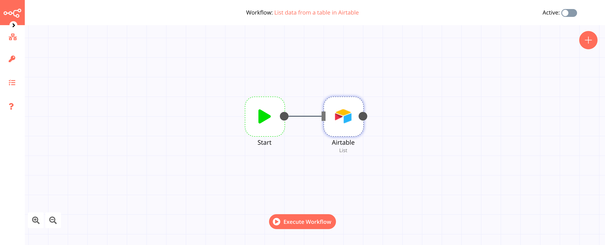

# Airtable

[Airtable](https://airtable.com/) is a spreadsheet-database hybrid, with the features of a database but applied to a spreadsheet. The fields in an Airtable table are similar to cells in a spreadsheet, but have types such as 'checkbox', 'phone number', and 'drop-down list', and can reference file attachments like images.

::: tip 🔑 Credentials
You can find authentication information for this node [here](../../../credentials/Airtable/README.md).
:::

## Basic Operations

- Append the data to a table
- Delete data from a table
- List data from a table
- Read data from a table
- Update data in a table

## Example Usage

This workflow allows you to insert and list data from a table in Airtable. You can also find the [workflow](https://n8n.io/workflows/601) on n8n.io. This example usage workflow would use the following nodes.
- [Start](../../core-nodes/Start/README.md)
- [Set](../../core-nodes/Set/README.md)
- [Airtable]()

The final workflow should look like the following image.

### 1. Start node

The start node exists by default when you create a new workflow.

### 2. Set node

1. Click on the ***Add Value*** button and select 'Number' from the dropdown list.
2. Enter `id` in the ***Name*** field.
3. Click on the ***Add Value*** button and select 'String' from the dropdown list.
4. Enter `name` in the ***Name*** field.
5. Enter the value for the name in the ***Value*** field.
6. Click on ***Execute Node*** to run the node.

### 3. Airtable node (Append)

1. First of all, you'll have to enter credentials for the Airtable node. You can find out how to do that [here](../../../credentials/Airtable/README.md).
2. Select the 'Append' option from the ***Operation*** dropdown list.
3. Enter the Base ID in the ***Base ID*** field. For obtaining the Base ID, head over to their [API page](https://airtable.com/api) and select the correct base. You’ll find the Base ID there.
4. Enter the name of the table in the ***Table*** field.
5. Click on ***Execute Node*** to run the workflow.

### 4. Airtable1 node (List)

1. Select the credentials that you entered in the previous node.
2. Select the 'List' option from the ***Operation*** dropdown list.
3. Enter the base ID used in the previous node in the ***Base ID*** field.
4. Enter the name of the table used in the previous node in the ***Table*** field.
5. Click on ***Execute Node*** to run the workflow.

## Further Reading

- [Automating Conference Organization Processes with n8n](https://medium.com/n8n-io/automating-conference-organization-processes-with-n8n-ab8f64a7a520)
- [Building an expense tracking app in 10 minutes 📱](https://medium.com/n8n-io/building-an-expense-tracking-app-in-10-minutes-74b0cececc90)
