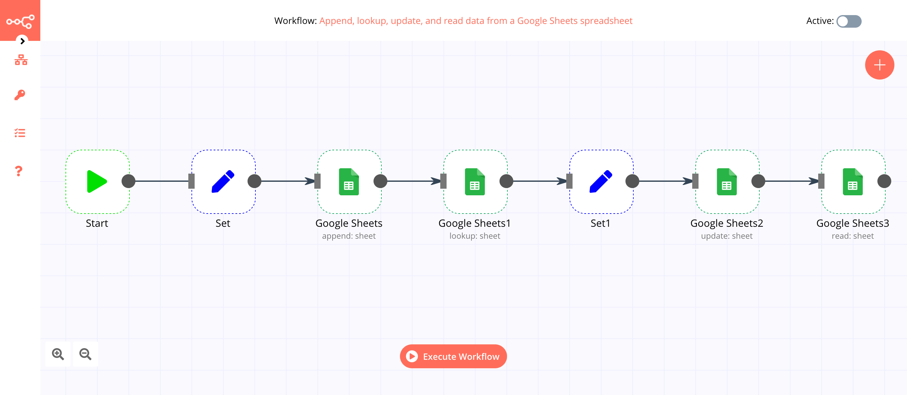

# Google Sheets

[Google Sheets](https://www.google.com/sheets) is a web-based spreadsheet program that is part of Google's office software  suite within its Google Drive service.

::: tip 🔑 Credentials
You can find authentication information for this node [here](../../../credentials/Google/README.md).
:::

## Basic Operations

- Append data to a sheet
- Clear data from a sheet
- Delete columns and rows from a sheet
- Look up a specific column value and return the matching row
- Read data from a sheet
- Update rows in a sheet

## Example Usage

This workflow shows you how to read from from a Google Sheets spreadsheet. You can also find the [workflow](https://n8n.io/workflows/449) on this website. This example usage workflow uses the following two nodes.
- [Start](../../core-nodes/Start/README.md)
- [Google Sheets]()

The final workflow should look like the following image.

### 1. Start node

The Start node exists by default when you create a new workflow.

### 2. Google Sheets node

1. First of all, you'll have to enter credentials for the Google Sheets node. You can find out how to do that [here](../../../credentials/Google/README.md), in the section 'Google Drive / Sheets API'.
2. Select 'OAuth2' in the *Authentication* field.
3. Copy the string of characters located between `/d/` and `/edit` in your spreadsheet URL. Paste that string in the *Sheet ID* field.
4. In the *Range* field, enter the range of columns to be read from your spreadsheet.
5. In the *Data Start Row* field, enter the number of the first row that contains data, excluding the header row. Keep in mind that it starts with 0. So, in case your data starts from row 2, you'd enter 1 in the field.
6. In the *Key Row* field, enter the number of the header row. Keep in mind that it starts with 0. So, in case your header is in row 1, you'd enter 0 in the field.
7. Click on *Execute Node* to run the workflow.
