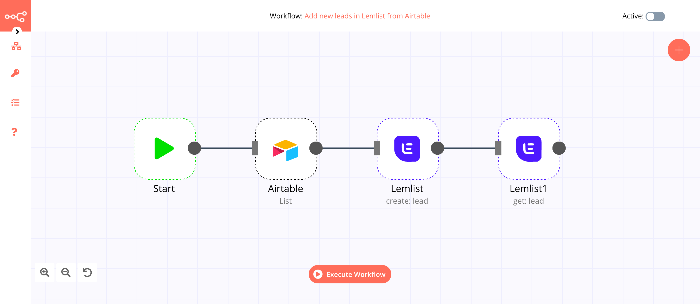
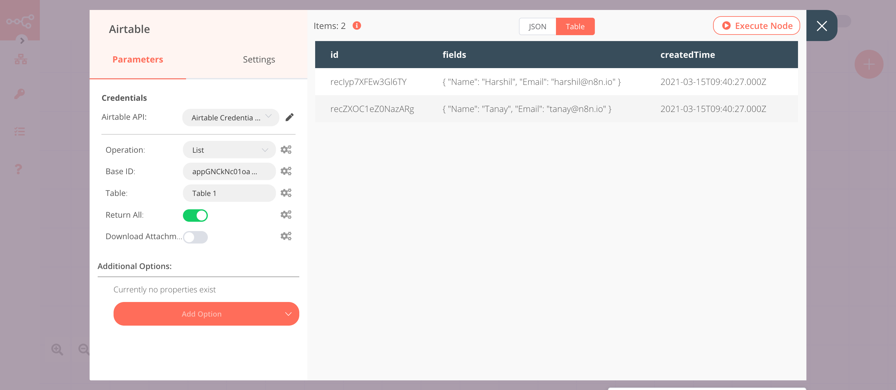
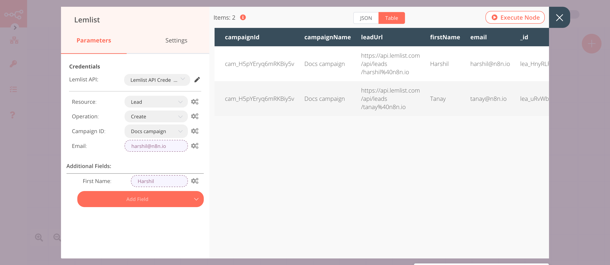
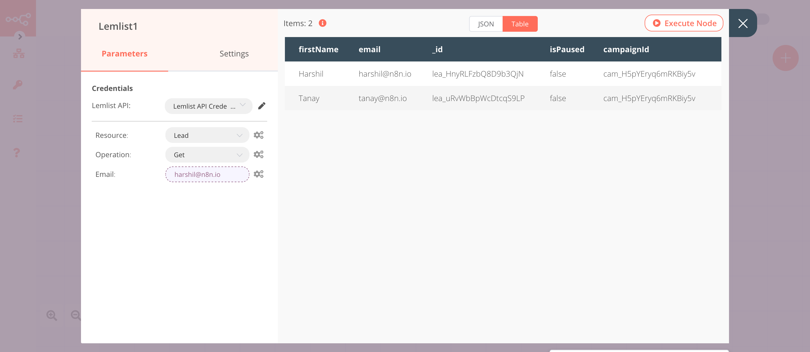

# Lemlist

[Lemlist](https://Lemlist.com) is an email outreach platform that allows you to automatically generate personalized images and videos and send personalized cold emails.

::: tip 🔑 Credentials
You can find authentication information for this node [here](../../../credentials/Lemlist/README.md).
:::

## Basic Operations

::: details Activity
- Get all activities
:::

::: details Campaign
- Get all campaigns
:::

::: details Lead
- Create a lead
- Delete a lead
- Get a lead
- Unsubscribe
:::

::: details Team
- Get a team
:::

::: details Unsubscribes
- Add
- Delete
- Get all
:::

## Example Usage

This workflow allows you to list emails from Airtable and create corresponding leads in Lemlist. You can also find the [workflow](https://n8n.io/workflows/983) on n8n.io. This example usage workflow uses the following nodes.
- [Start](../../core-nodes/Start/README.md)
- [Airtable](../Airtable/README.md)
- [Lemlist]()

The final workflow should look like the following image.

### 1. Start node

The start node exists by default when you create a new workflow.

### 2. Airtable node (List)

This node will list all the records from Airtable. Create a table like [this](https://airtable.com/shruiCc4kttDVsTsD) in your Airtable base.

1. First of all, you'll have to enter credentials for the Airtable node. You can find out how to do that [here](../../../credentials/Airtable/README.md).
2. Select the 'List' option from the ***Operation*** dropdown list.
3. Enter the Base ID in the ***Base ID*** field. For obtaining the Base ID, head over to their [API page](https://airtable.com/api) and select the correct base. You’ll find the Base ID there.
4. Enter the name of your table in the ***Table*** field.
5. Click on the gears icon next to the ***Table*** field and click on ***Add Expression***.
6. Click on ***Execute Node*** to run the node.

In the screenshot below, you will notice that the node returns the information of the leads.

### 3. Lemlist node (create: lead)

This node will create new leads for a campaign in Lemlist.

1. First of all, you'll have to enter credentials for the Lemlist node. You can find out how to do that [here](../../../credentials/Lemlist/README.md).
2. Select 'Lead' from the ***Resource*** dropdown list.
3. Select a campaign from the ***Campaign ID*** dropdown list.
4. Click on the gears icon next to the ***Email*** field and click on ***Add Expression***.
::: v-pre
5. Select the following in the ***Variable Selector*** section: Current Node > Input Data > JSON > fields > Email. You can also add the following expression: `{{$json["fields"]["Email"]}}`.
6. Click on the ***Add Field*** button and select 'First Name'.
7. Click on the gears icon next to the ***First Name*** field and click on ***Add Expression***.
8. Select the following in the ***Variable Selector*** section: Current Node > Input Data > JSON > fields > Name. You can also add the following expression: `{{$json["fields"]["Name"]}}`.
9. Click on ***Execute Node*** to run the node.

In the screenshot below, you will notice that the node creates new leads in Lemlist.

### 4. Lemlist node (get: lead)

This node will return the information of the leads that we created in the previous node.
::: v-pre
1. Select the credentials that you entered in the previous node.
2. Select 'Lead' from the ***Resource*** dropdown list.
3. Select 'Get' from the ***Operation*** dropdown list.
4. Click on the gears icon next to the ***Email*** field and click on ***Add Expression***.
5. Select the following in the ***Variable Selector*** section: Nodes > Airtable > Output Data > JSON > fields > Email. You can also add the following expression: `{{$node["Airtable"].json["fields"]["Email"]}}`.
6. Click on ***Execute Node*** to run the node.

In the screenshot below, you will notice that the node returns the information about the leads we created in the previous node.

