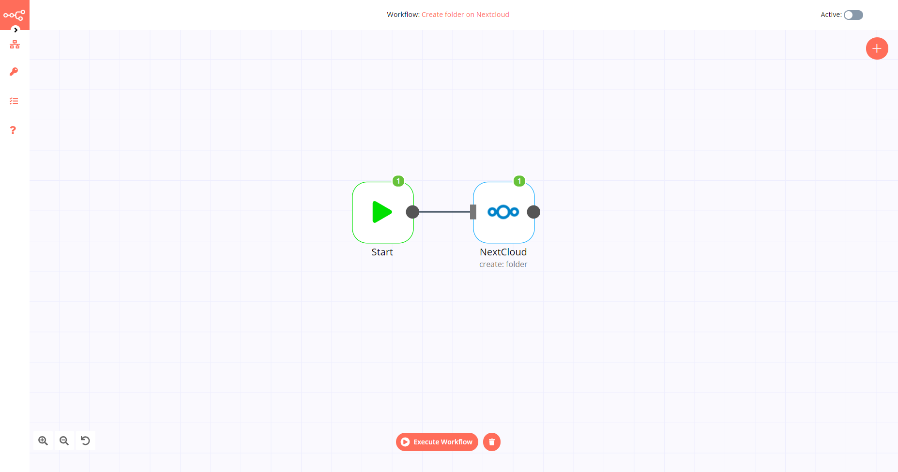

# Nextcloud

[Nextcloud](https://nextcloud.com/) is a free and open source suite of client-server software for creating and using file hosting services.

::: tip 🔑 Credentials
You can find authentication information for this node [here](../../../credentials/Nextcloud/README.md).
:::

## Basic Operations

- File
	- Copy a file
	- Delete a file
	- Download a file
	- Move a file
	- Upload a file
- Folder
	- Copy a folder
	- Create a folder
	- Delete a folder
	- Return the contents of a folder
	- Move a folder

## Example Usage

This workflow allows you to create a folder in Nextcloud. You can also find the [workflow](https://n8n.io/workflows/564) on the website. This example usage workflow would use the following two nodes.
- [Start](../../core-nodes/Start/README.md)
- [Nextcloud]()

The final workflow should look like the following image.

### 1. Start node

The start node exists by default when you create a new workflow.

### 2. Nextcloud node

1. First of all, you'll have to enter credentials for the Nextcloud node. You can find out how to do that [here](../../../credentials/Nextcloud/README.md).
2. Select the 'Folder' option from the *Resource* dropdown list.
3. Select the 'Create' option from the *Operation* dropdown list.
4. Enter a folder name in the *Folder* field.
5. Click on *Execute Node* to run the workflow.
