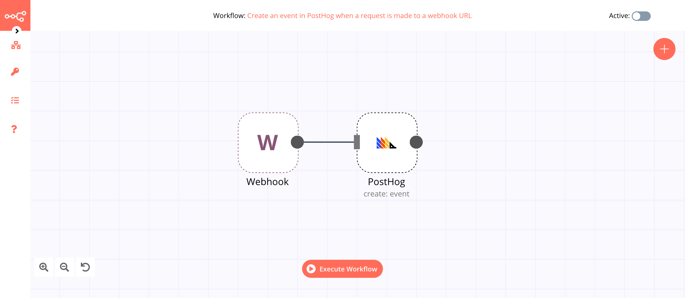
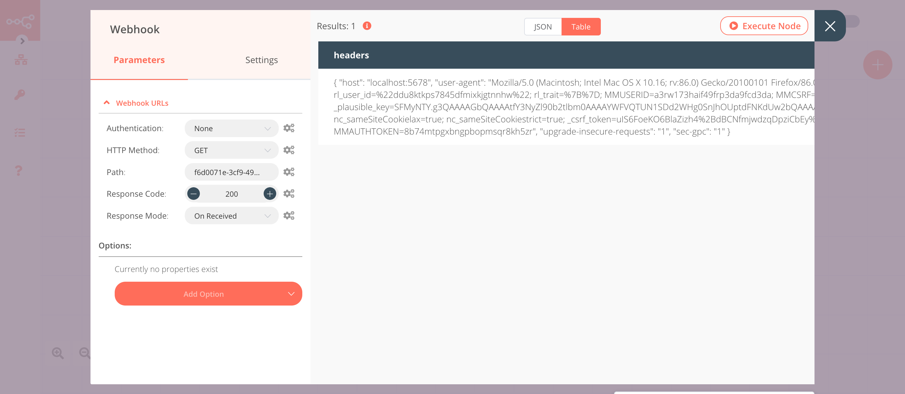
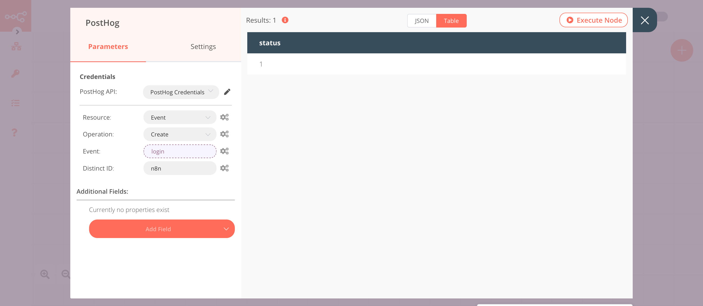

# PostHog

[PostHog](https://posthog.com) is an open-source product analytics platform. It provides tools to improve your product, such as session recording, heatmaps, and feature flags.

::: tip 🔑 Credentials
You can find authentication information for this node [here](../../../credentials/PostHog/README.md).
:::

## Basic Operations

::: details Alias
- Create an alias
:::

::: details Event
- Create an event
:::

::: details Identity
- Create an identity
:::

::: details Track
- Track a page
- Track a screen
:::

## Example Usage

This workflow allows you to create an event in PostHog when a request is made to a webhook URL. You can also find the [workflow](https://n8n.io/workflows/968) on n8n.io. This example usage workflow uses the following nodes.
- [Webhook](../../core-nodes/Webhook/README.md)
- [PostHog]()

The final workflow should look like the following image.

### 1. Webhook node

This node will trigger the workflow. We will make a GET request to the test webhook URL and pass on a query parameter called  `event`.

1. Click on ***Webhook URLs*** and select the 'Test' tab.
2. Copy the displayed URL. We will make a GET request to this URL later on.
3. Save the workflow to register the webhook.
4. Click on ***Execute Node*** to run the node.
5. In a new browser tab, paste the URL that you copied in the previous step and append `?event=login` to it. Your URL should look similar to the following URL:`https://your-n8n.url/webhook/path?event=login`. Here, we are passing a query parameter called `event` and assigning the value `login` to it.
6. Press Enter (or Return) to make a request to the test webhook URL.

In the screenshot below, you will notice that the node triggers the workflow and receives a query parameter. We will use the value of the query parameter in the next node in the workflow.

### 2. PostHog node (create:customer)

This node will create a new event in PostHog.

1. First of all, you'll have to enter credentials for the PostHog node. You can find out how to do that [here](../../../credentials/PostHog/README.md).
2. Click on the gears icon next to the ***Event*** field and click on ***Add Expression***.
::: v-pre
3. Select the following in the ***Variable Selector*** section: Current Node > Input Data > JSON > query > event. You can also add the following expression: `{{$json["query"]["event"]}}`.
:::
4. Enter a distinct id in the ***Distinct ID*** field.
5. Click on ***Execute Node*** to run the node.

In the screenshot below, you will notice that the node creates a new event in PostHog.

::: tip 💡 Activate workflow for production
This example workflow uses the Webhook node, which is a Trigger node. You'll need to save the workflow and then click on the Activate toggle on the top right of the screen to activate the workflow. Your workflow will then be triggered every time a GET request is sent to the ***Production*** webhook URL.
:::
