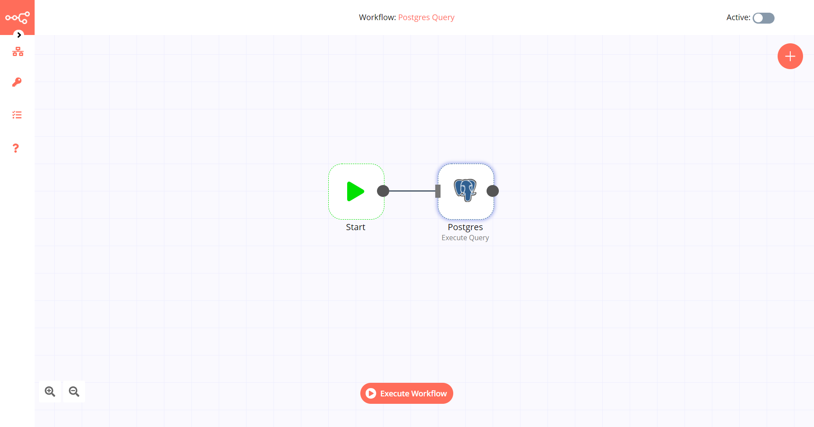

# Postgres

[PostgreSQL](https://www.postgresql.org/), also known as Postgres, is a free and open-source relational database management system emphasizing extensibility and SQL compliance.

::: tip 🔑 Credentials
You can find authentication information for this node [here](../../../credentials/Postgres/README.md).
:::

## Basic Operations

- Execute an SQL query <!-- Changes needed on code repo -->
- Insert rows in database
- Update rows in database <!-- Changes needed on code repo -->

## Example Usage

This workflow allows you to run an SQL query on a Postgres instance. You can also find the [workflow](https://n8n.io/workflows/458) on the website. This example usage workflow would use the following two nodes.
- [Start](../../core-nodes/Start/README.md)
- [Postgres]()

The final workflow should look like the following image.

### 1. Start node

The start node exists by default when you create a new workflow.

### 2. Postgres node

1. First of all, you'll have to enter credentials for the Postgres node. You can find out how to do that [here](../../../credentials/Postgres/README.md).
2. Select 'Execute Query' from the *Operation* dropdown list.
3. Enter your SQL query in the *Query* field.
4. Click on *Execute Node* to run the workflow.

<!-- ## Further Reading

Maybe include a simple SQL Guide here? 
- [W3Schools SQL](https://www.w3schools.com/sql/)
-->
