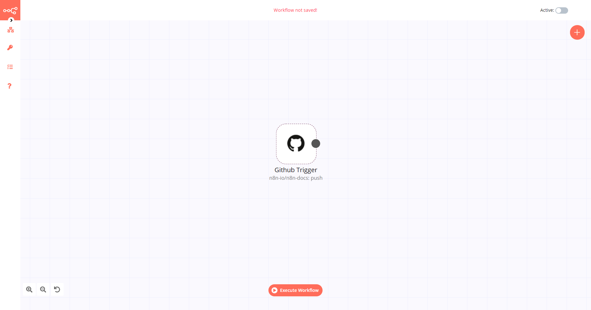

# GitHub Trigger

[GitHub](https://github.com/) provides hosting for software development and version control using Git. It offers the distributed version control and source code management (SCM) functionality of Git, access control and several collaboration features such as bug tracking, feature requests, task management, and wikis for every project.

::: tip 🔑 Credentials
You can find authentication information for this node [here](../../../credentials/Github/README.md).
:::

## Example Usage

This workflow allows you to receive updates for GitHub events. You can also find the [workflow](https://n8n.io/workflows/527) on the website. This example usage workflow would use the following node.
- [GitHub Trigger]()

The final workflow should look like the following image.

### 1. GitHub Trigger node

1. First of all, you'll have to enter credentials for the GitHub Trigger node. You can find out how to do that [here](../../../credentials/Github/README.md).
2. Enter the repository owner in the *Repository Owner* field.
3. Enter the repository name in the *Repository Name* field.
4. Select the `*` option in the *Events* field to receive updates when any event is triggered.
5. Click on *Execute Node* to run the workflow.
